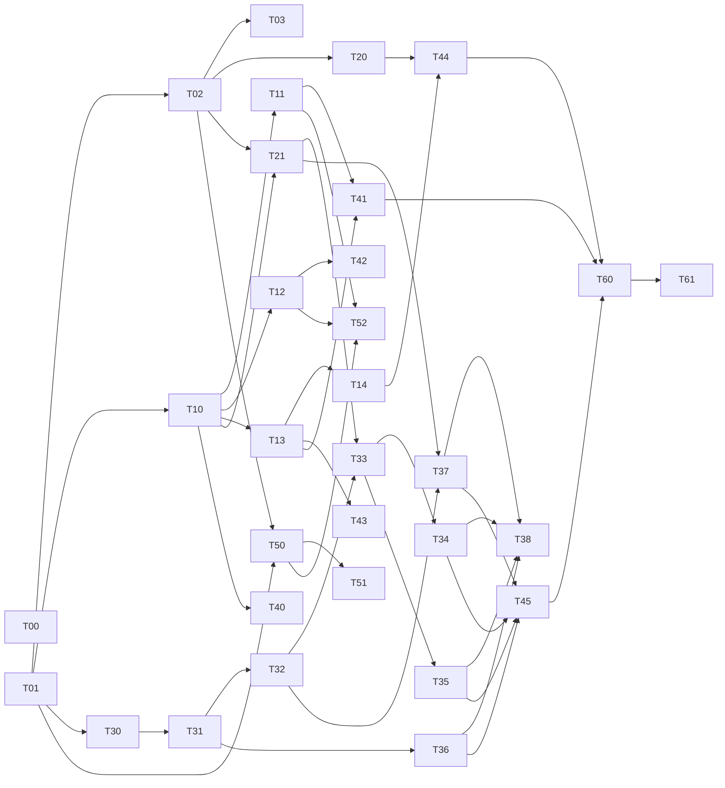

# Brink — Implementation Tickets

> **For Claude:** Each ticket is independently assignable to one agent on its own git
> branch/worktree. REQUIRED SUB-SKILL when executing a ticket: `executing-plans`
> (TDD, bite-sized steps, frequent commits). Do **not** execute all tickets at once.

**Goal:** Take Brink from "good Spotify read-demo over a mock backend" to the spec's target
state — real Postgres backend, real auth, real social features, real Python analytics, real
artist portal.

**Architecture:** React/Vite SPA + Vercel serverless functions (TypeScript, Prisma) +
**Supabase** (Postgres + Auth + Storage) + a Python/scikit-learn batch job on GitHub Actions
cron + Vercel Cron.

> **Platform note (2026-06-22):** consolidated onto **Supabase** for DB + Auth + Storage.
> This supersedes earlier Neon/Cloudinary/Resend references in the tickets below — the auth
> tickets (T02/T03) now build on **Supabase Auth**, and media tickets (T50/T51) use
> **Supabase Storage**. Exact Supabase wiring is re-specced when each ticket is executed.

**Source of truth:** `docs/plans/2026-06-22-brink-spec-design.md` (requirement IDs `AUTH-*`,
`BE-*`, `SP-*`, `AN-*`, `UI-*`, `MEDIA-*`, `INFRA-*`, `DATA-*`).

**Branch convention:** `feat/<ticket-id>-<slug>` (e.g. `feat/T01-infra-prisma`).
Each ticket = one PR. Peer review required (proposal §6).

---

## How to run these tickets

1. Each ticket lists **Depends on**. A ticket may start only when its deps are merged
   (or, for parallel work, branched off the dep's branch).
2. Use a **git worktree per agent** (`using-git-worktrees` skill) so branches don't collide.
3. Tickets in the same "wave" below have no inter-dependencies and can run **in parallel**.

### Dependency / parallelization waves

| Wave | Tickets | Notes |
|------|---------|-------|
| 0 | **T00, T01** | Foundation — must land before almost everything (T00 is independent/trivial). |
| 1 | T02, T10, T30 | Auth/tokens · posts+track API · Python scaffold — parallel after T01. |
| 2 | T03, T11, T12, T13, T20, T21, T31, T40, T50 | Email auth · reactions · comments · follow+feed · now-playing · snapshots · Kaggle join · composer · Supabase Storage backend. |
| 3 | T14, T32, T33, T36, T41, T42, T43, T51, T52 | Profile API · seed users · taste vectors · regression · feed/comments/follow UI · artist upload UI + engagement. |
| 4 | T34, T35, T37, T44 | K-means · compatibility · UserStats · profile UI live. |
| 5 | T38, T45, T60, T61 | Pipeline cron · analytics UI · retire mocks · QA/load. |

**Total estimate:** ~210–260 incremental hours (within the 300h budget; foundation + analytics are the heaviest).

---

## EPIC A — Foundation & Infra

### T00 — Secret hygiene & repo cleanup `feat/T00-cleanup`
**Depends on:** none · **Est:** 1h · **Reqs:** INFRA-5, BE-2 (partial), DATA-4 (partial)
- **Files:** `.gitignore`, delete `apps/web/src/lib/api.ts` (dead `MOCK=true`), confirm `.env*` ignored.
- **Do:** ensure `.env`, `.env.local` git-ignored; remove dead legacy `lib/api.ts` and its imports (none should exist — verify with grep). If the app reuses the Spotify creds leaked in `June_11_testing.ipynb`, note in PR that they must be rotated in the Spotify dashboard.
- **Tests:** `grep -r "lib/api" apps/web/src` returns nothing; `npm run build` passes.
- **Done when:** dead file gone, build green, no secrets tracked.

### T01 — Supabase + Prisma + serverless TS + test tooling `feat/T01-infra-prisma` ✅ DONE
**Depends on:** none (blocks most) · **Est:** 10h · **Reqs:** INFRA-1, INFRA-2, BE-1, BE-11
- **Manual (user):** create a Supabase project; copy the Prisma pooled `DATABASE_URL` (6543) + `DIRECT_URL` (5432) into env; disable the Data API. *(Done: `brink-dev` project, 14 tables migrated live.)*
- **Files:**
  - Create `prisma/schema.prisma` — paste the full model from spec §3 Layer 2.
  - Create `api/_lib/prisma.ts` — singleton Prisma client (serverless-safe: reuse global instance).
  - Create `api/_lib/respond.ts` — consistent `{data}|{error}` JSON helpers.
  - Modify `package.json` (root) — add `@prisma/client`, `prisma`, `typescript`, `@vercel/node`, `jest`, `ts-jest`, `supertest`, `@types/*`; scripts: `prisma:migrate`, `prisma:generate`, `test`.
  - Convert `api/` to TypeScript functions (`api/*.ts`, `@vercel/node` `VercelRequest/Response`).
  - Modify `vercel.json` — ensure `/api/*` resolves to TS functions; add Prisma generate to build.
  - Create `jest.config.cjs` + `api/__tests__/health.test.ts`.
  - Create `api/health.ts` — returns `{ ok: true, db: <SELECT 1 result> }`.
- **TDD:** test `GET /api/health` returns 200 + db reachable (DB mocked in unit test).
- **Done when:** `npx prisma migrate deploy` creates all 14 tables on Supabase; `npm test` green; live read verified. ✅

---

## EPIC B — Auth & Identity

### T02 — Supabase Auth + Spotify provider token capture `feat/T02-auth-spotify`
**Depends on:** T01 · **Est:** 10h · **Reqs:** AUTH-1, AUTH-2, AUTH-4, AUTH-5
- **Manual (user):** Supabase dashboard → Authentication → Providers → enable **Spotify**, paste a Spotify app's Client ID + Secret, set scopes (`user-read-recently-played user-top-read user-read-currently-playing user-read-email`), add redirect URLs.
- **Schema:** add `supabaseUserId String @unique` to `User` (new migration) linking our row to the Supabase auth user.
- **Files:**
  - Create `apps/web/src/lib/supabase.ts` — `@supabase/supabase-js` client (`VITE_SUPABASE_URL`, `VITE_SUPABASE_ANON_KEY`).
  - Modify `LoginPage.tsx` / `AuthContext.tsx` — `supabase.auth.signInWithOAuth({ provider:'spotify', options:{ scopes } })`; drop the hand-rolled PKCE flow in `lib/spotify-auth.ts`.
  - Create `api/_lib/auth.ts` — `requireUser(req)`: verify the Supabase JWT, sync/return the `public.User` row.
  - Create `api/auth/capture-spotify.ts` — read `provider_refresh_token` from the session, store encrypted in `SpotifyToken` (`api/_lib/crypto.ts`, AES-GCM, `TOKEN_ENC_KEY`).
  - Create `api/_lib/spotify.ts` — server-side `getValidAccessToken(userId)` (we refresh; Supabase does not).
- **TDD:** mock a Supabase JWT → `requireUser` resolves/creates the `User`; token encrypt/decrypt round-trip; capture stores `SpotifyToken`.
- **Done when:** Spotify login via Supabase creates a `User`, stores the encrypted refresh token, and `requireUser` gates a sample protected route.

### T03 — Email (handle) accounts via Supabase Auth `feat/T03-auth-email`
**Depends on:** T01, T02 (`requireUser`) · **Est:** 5h · **Reqs:** AUTH-3, AUTH-6
- **Manual (user):** Supabase → Authentication → enable Email (magic-link/OTP); set the email redirect URL.
- **Files:**
  - Modify `LoginPage.tsx` — "continue with email" → `supabase.auth.signInWithOtp({ email })` (Supabase sends the email; no Resend).
  - Create `apps/web/src/pages/SignupPage.tsx` — collect display name + handle; persisted to `public.User` on first `requireUser` sync.
  - Ensure handle uniqueness server-side.
- **TDD:** email sign-in syncs a handle `User` (`spotifyId=null`); handle uniqueness enforced.
- **Done when:** a non-Spotify user signs in via Supabase magic link, gets a handle account, uses the app (stats prompt "link Spotify").

---

## EPIC C — Backend Social API

### T10 — Posts API + Track upsert `feat/T10-posts-api`
**Depends on:** T01 (+ T02 for auth) · **Est:** 8h · **Reqs:** BE-3, SP-3 (track upsert)
- **Files:** `api/posts/index.ts` (`POST` create, `GET` list-by-user), `api/_lib/tracks.ts` (`upsertTrack`).
- **Logic:** create post requires session; `source` MANUAL|SPOTIFY; ensure `Track` row exists (upsert from provided Spotify track metadata).
- **TDD:** POST without session → 401; valid POST creates `Post`+`Track`; bad track payload → 400.
- **Done when:** posts persist with linked track; covered by tests.

### T11 — Reactions API `feat/T11-reactions-api`
**Depends on:** T01, T10 · **Est:** 4h · **Reqs:** BE-5
- **Files:** `api/posts/[id]/reactions.ts` (`POST` add / `DELETE` remove).
- **Logic:** server-enforced dedup via `@@unique([postId,userId,type])`; toggling returns fresh counts.
- **TDD:** double-react same type → single row (idempotent); delete removes; counts correct.

### T12 — Comments API `feat/T12-comments-api`
**Depends on:** T01, T10 · **Est:** 4h · **Reqs:** BE-6
- **Files:** `api/posts/[id]/comments.ts` (`POST`/`GET`).
- **TDD:** create requires session + non-empty body; list returns newest-first with author.

### T13 — Follow graph + Feed `feat/T13-follow-feed`
**Depends on:** T01, T10 · **Est:** 8h · **Reqs:** BE-4, BE-7
- **Files:** `api/follow/[userId].ts` (`POST`/`DELETE`), `api/feed.ts` (`GET`).
- **Logic:** feed = posts from followed users + self, newest-first, with track + reaction/comment counts + viewer's reaction state. No follow → feed shows self + suggestions (optional).
- **TDD:** follow then feed includes followee's posts; unfollow removes them; counts + viewer-reaction flags correct.
- **Done when:** real follow graph drives the feed (replaces "show all users").

### T14 — Profile API `feat/T14-profile-api`
**Depends on:** T01, T13; reads analytics tables (degrade if empty per spec) · **Est:** 5h · **Reqs:** BE-8
- **Files:** `api/users/[id]/profile.ts`.
- **Logic:** returns user + `UserStats`/`TasteVector`/cluster (nullable) + `Compatibility` vs viewer. Empty stats render gracefully.
- **TDD:** profile with no stats returns nulls (200, not 500); with seeded stats returns them.

---

## EPIC D — Spotify Integration

### T20 — Currently playing `feat/T20-now-playing`
**Depends on:** T02 · **Est:** 3h · **Reqs:** SP-1, UI-10
- **Files:** `api/_lib/spotify.ts` (+`getCurrentlyPlaying`), `api/me/now-playing.ts`, UI badge in `ProfilePage`/feed.
- **TDD:** mock 200 (track) and 204 (nothing playing) → correct shapes.

### T21 — Scheduled play snapshots + Vercel Cron `feat/T21-snapshot-cron`
**Depends on:** T02, T10 (track upsert) · **Est:** 8h · **Reqs:** SP-2, SP-4, SP-5, INFRA-3
- **Files:** `api/jobs/snapshot.ts` (iterate Spotify-linked users, refresh token, pull recently-played, upsert `Track`, insert `Play` dedup on `userId+playedAt`), add `crons` entry to `vercel.json` (e.g. every 2h), protect with `CRON_SECRET`.
- **TDD:** mock recently-played → inserts new plays, skips duplicates; 429 backoff path; unlinked user skipped.
- **Done when:** cron populates `Play` history that analytics consumes.

---

## EPIC E — Analytics (Python pipeline)

> New dir `analytics/` (Python, managed with **`uv`**). Uses scikit-learn, pandas,
> psycopg/SQLAlchemy. Reads Supabase, reads Kaggle CSV, writes result tables. Tested with
> `uv run pytest`. All Python commands run via `uv run ...`; deps pinned in `uv.lock`.

### T30 — Python project scaffold + DB access `feat/T30-analytics-scaffold`
**Depends on:** T01 · **Est:** 4h · **Reqs:** AN-8 (partial), INFRA-4 (partial)
- **Setup:** `uv init analytics`; add deps with `uv add scikit-learn pandas sqlalchemy psycopg[binary]` and `uv add --dev pytest`; commit `uv.lock`.
- **Files:** `analytics/pyproject.toml`, `analytics/uv.lock`, `analytics/db.py` (read/write helpers, env `DATABASE_URL`), `analytics/tests/test_db.py`.
- **TDD:** `uv run pytest` — can connect + read `Track` count from a test DB.

### T31 — Kaggle ingest + audio-feature join `feat/T31-kaggle-join`
**Depends on:** T30 · **Est:** 8h · **Reqs:** AN-1, DATA-1, C4
- **Manual (user):** download chosen ~1M-track audio-features dataset; store path/URL.
- **Files:** `analytics/ingest_kaggle.py` — load CSV, normalize, join to `Track` on `spotifyId`/track_id, set audio features + `kaggleMatched`, log coverage %.
- **TDD:** join sets features on matches; non-matches flagged `kaggleMatched=false`; coverage logged.

### T32 — Synthetic user seeding `feat/T32-seed-users`
**Depends on:** T30, T31 · **Est:** 6h · **Reqs:** DATA-2, DATA-3
- **Files:** `analytics/seed_users.py` — create ~100–200 `User(isSynthetic=true)` with plausible `Play` histories sampled from Kaggle tracks (varied taste profiles).
- **TDD:** seeds N users with non-trivial, varied play histories; all flagged synthetic.

### T33 — Taste vectors `feat/T33-taste-vectors`
**Depends on:** T31, T32, T21 (real plays optional) · **Est:** 8h · **Reqs:** AN-2, C4
- **Files:** `analytics/features.py` — per-user vector [genre mix, mean popularity, diversity, recency/frequency, mean audio features]; standardize; genre-only fallback when audio features missing; write `TasteVector` + coverage.
- **TDD:** known fixture → expected vector; fallback path produces a valid genre-only vector.

### T34 — K-means clustering + assignment `feat/T34-kmeans`
**Depends on:** T33 · **Est:** 10h · **Reqs:** AN-3, AN-4
- **Files:** `analytics/cluster.py` — K-means on Kaggle tracks; select k via elbow + silhouette; human-readable labels; write `Cluster` rows; assign each user to nearest (write `User.clusterId`); write `ModelMetrics(kmeans: silhouette,k)`.
- **TDD:** deterministic seed → stable k/labels; every user assigned; silhouette persisted.

### T35 — Compatibility `feat/T35-compatibility`
**Depends on:** T33 · **Est:** 5h · **Reqs:** AN-5
- **Files:** `analytics/compat.py` — cosine similarity of full taste vectors; write pairwise `Compatibility` (0..1); cap pair count sensibly (e.g. top-N per user) for scale.
- **TDD:** identical vectors → 1.0; orthogonal → 0.0; symmetric.

### T36 — Popularity regression `feat/T36-regression`
**Depends on:** T31 · **Est:** 5h · **Reqs:** AN-6, C5
- **Files:** `analytics/regression.py` — fit linear regression: audio features → `popularity`; train/test split; write `ModelMetrics(popularity_regression: r2,rmse,featureImportances)`. Labeled exploratory.
- **TDD:** runs on fixture; persists finite r2/rmse + per-feature coefficients.

### T37 — Aggregations / UserStats `feat/T37-userstats`
**Depends on:** T21 (plays), T32 · **Est:** 6h · **Reqs:** AN-7
- **Files:** `analytics/aggregate.py` — top tracks/genres/artists, streak length, 30-day totals from full `Play` history; write `UserStats`.
- **TDD:** streak/total computed from multi-day fixture (not 50-capped).

### T38 — Pipeline orchestration + GitHub Actions cron `feat/T38-pipeline-cron`
**Depends on:** T31–T37 · **Est:** 5h · **Reqs:** AN-8, INFRA-4
- **Files:** `analytics/run_pipeline.py` (idempotent: ingest→features→cluster→compat→regression→aggregate, logs coverage/k/silhouette/R²/RMSE), `.github/workflows/analytics.yml` (uses `astral-sh/setup-uv`, runs `uv sync` + `uv run python run_pipeline.py`; scheduled + manual dispatch, `DATABASE_URL` secret).
- **TDD:** end-to-end dry run on test DB completes idempotently; re-run produces consistent results.

---

## EPIC F — Frontend (live wiring)

### T40 — Post composer + Spotify catalog search `feat/T40-composer`
**Depends on:** T10 · **Est:** 8h · **Reqs:** UI-1
- **Files:** `apps/web/src/components/Composer.tsx`, `api/search.ts` (Spotify client-credentials catalog search — works for handle users), wire into `FeedPage`.
- **Done when:** any user can search a track and publish a post that persists.

### T41 — Feed + reactions live `feat/T41-feed-live`
**Depends on:** T10, T11, T13 · **Est:** 8h · **Reqs:** UI-2, UI-3, UI-9
- **Files:** modify `FeedPage.tsx`, `components/PostCard.tsx`, replace `lib/data.ts` feed path; optimistic reactions reconciled with server; loading/empty/error states; remove mock fallback.

### T42 — Comments UI `feat/T42-comments-ui`
**Depends on:** T12 · **Est:** 4h · **Reqs:** UI-4
- **Files:** `PostCard.tsx` — real comment input + list (remove dead button).

### T43 — Follow UI `feat/T43-follow-ui`
**Depends on:** T13 · **Est:** 3h · **Reqs:** UI-5
- **Files:** `ProfilePage.tsx`, `ArtistPage.tsx` — wire Follow buttons + follower counts.

### T44 — Profile live + now-playing `feat/T44-profile-live`
**Depends on:** T14, T20 · **Est:** 6h · **Reqs:** UI-6, UI-10
- **Files:** `ProfilePage.tsx` reads `/api/users/:id/profile`; Wrapped stats from `UserStats`; cluster label; compatibility; "link Spotify" prompt for handle users; now-playing badge.

### T45 — Analytics UI on real tables + fold Predict `feat/T45-analytics-ui`
**Depends on:** T34, T35, T36, T37 · **Est:** 8h · **Reqs:** UI-7, UI-8, AN-9
- **Files:** `AnalyticsPage.tsx` reads `ModelMetrics`/`Cluster`/`Compatibility`; remove `CLUSTER_POINTS` + hardcoded silhouette/feature-importance; migrate any real Predict widget here; delete `PredictPage.tsx` + route + fabricated copy.
- **Done when:** no hardcoded analytics numbers remain; anything illustrative is labeled.

---

## EPIC G — Artist Portal

### T50 — Supabase Storage signed-upload backend `feat/T50-storage-backend`
**Depends on:** T01, T02 · **Est:** 5h · **Reqs:** MEDIA-1, MEDIA-3, BE-9
- **Manual (user):** create a private Supabase Storage bucket `artist-images`; `SUPABASE_SERVICE_ROLE_KEY` in env.
- **Files:** `api/artist/sign-upload.ts` (mint a Supabase Storage signed upload URL via the service role), `api/artist/posts.ts` (create `ArtistPost` with the stored object URL + optional `linkedTrackId`).
- **TDD:** signed-upload endpoint returns a valid URL; create persists `ArtistPost`.

### T51 — Artist upload UI + validation `feat/T51-artist-upload-ui`
**Depends on:** T50 · **Est:** 8h · **Reqs:** MEDIA-2, MEDIA-5
- **Files:** `ArtistPage.tsx` — file picker, client+server ≤10MB + JPEG/PNG validation, upload to the Supabase Storage signed URL, progress/error states; replace `SAMPLE_BTS`.
- **Done when:** ≥98% upload success across 5 file types up to 10MB (integration test).

### T52 — Artist engagement analytics `feat/T52-artist-engagement`
**Depends on:** T50, T11, T12 · **Est:** 4h · **Reqs:** MEDIA-4
- **Files:** per-`ArtistPost` reactions/comments/views surfaced to the artist.

---

## EPIC H — Cleanup & QA

### T60 — Retire mocks + dead paths `feat/T60-retire-mocks`
**Depends on:** T41, T44, T45 · **Est:** 3h · **Reqs:** DATA-4, BE-2 (final), UI-9
- Remove `mocks/feed.ts`, `mocks/stats.ts`, jsonblob `api/state.js`, residual heuristic `lib/analytics.ts` paths from production code.

### T61 — Test sweep + k6 load + cross-browser E2E `feat/T61-qa`
**Depends on:** all feature tickets · **Est:** 8h · **Reqs:** proposal §6, §11
- Jest+Supertest coverage on all `/api/*`; pytest on analytics; manual E2E Chrome/Firefox/Safari; k6 at 5 concurrent users; verify success metrics (OAuth ≥95%, upload ≥98%, 6/6 features).

---

## Suggested first move
Land **T00** (trivial cleanup) and **T01** (foundation) first — everything else depends on
T01. Then fan agents across Wave 1 (T02, T03, T10/T30 prep). Use one worktree per agent.
