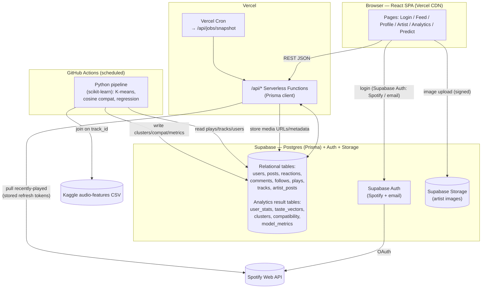

# Brink — Spec-Driven Design Document

**Status:** Draft for review · **Date:** 2026-06-22 · **Deadline:** 2026-07-30
**Scope basis:** `Brink_Proposal_Final.pdf` (binding rubric for in-scope features)

This document defines the **target state** of Brink layer by layer, states **where each
layer is today**, and lists **precise, testable requirements** to close the gap. Every
requirement has an ID (e.g. `BE-3`) so the implementation plan can reference it directly.

---

## 0. Decision Log (locked)

These are the architectural forks we decided deliberately. Deviations from the proposal
are intentional and must be defended in the final report.

| # | Decision | Choice | Why |
|---|----------|--------|-----|
| A | API + persistence | **Vercel serverless functions + Supabase (Postgres) + Prisma** | Real relational data + schema, single deploy, no cold-start stall. Supabase chosen over Neon to **consolidate** DB + Auth + Storage in one platform. *Deviation from proposal's "Express on Render" — documented.* |
| B | Analytics runtime | **Python + scikit-learn batch job writing result tables to Postgres** | Real ML (K-means, regression, cosine) is the graded centerpiece; batch job decouples cleanly from the app (app just reads result tables). |
| C1 | Listening history | **Snapshot recently-played into Postgres on a schedule** | Spotify returns only the last 50 plays; snapshots make 30-day stats + streaks genuinely real and make the "aggregation pipeline" real. |
| C2 | K-means unit | **Both: cluster Kaggle tracks into audio segments, then assign/cluster users within that space** | Guarantees real ML (elbow/silhouette on real track data) even with few users, and still yields emergent listener segments. |
| C3 | Synthetic users | **Seed ~100–200 synthetic listeners (sampled from real Kaggle tracks), disclosed as demo data** | Feed, compatibility, and user-level clustering need population; disclosure keeps it honest. |
| C4 | Audio-feature gaps | **Genre-only fallback vector when a track isn't in the Kaggle set; report coverage %** | Coverage will be imperfect (emerging artists); honest fallback is defensible. |
| C5 | Popularity regression | **Build it, scoped small; report R²/RMSE + feature importances, labeled exploratory** | Cheap second real model; strengthens the analytics story. |
| D | Identity | **Supabase Auth** — Spotify OAuth (via Supabase's Spotify provider) + email/OTP handle accounts | Managed login/sessions; honors "manual posting without Spotify" scope without building our own auth. We still capture + refresh the Spotify provider tokens for the data pipeline. |
| E | Scheduling | **GitHub Actions cron (Python pipeline) + Vercel Cron (Spotify snapshots)** | Free, no extra hosting, clean separation of the two scheduled concerns. |

**Confirmed decisions:**
- **Platform:** **Supabase** provides Postgres + Auth + Storage (full consolidation).
  Supersedes Neon (DB), Cloudinary (storage), and Resend (auth emails). One vendor.
- **Media storage:** **Supabase Storage** (signed uploads) for artist BTS images (`MEDIA` layer).
- **Kaggle dataset:** **larger audio-features set (≈1M+ tracks)** for better `track_id` join
  coverage. Proposal's cited `maharshipandya` (~114k) is superseded — defended as a
  deliberate coverage choice; correct the proposal's "~1M+" line to name the actual set used.
- **Spotify tokens:** captured from Supabase Auth's Spotify provider (`provider_refresh_token`)
  and persisted **server-side (encrypted)**; we own token refresh so the snapshot job can pull
  plays without the user present (required by C1).
- **Handle-account sign-in (decision D):** **Supabase Auth** email magic-link / OTP. No custom
  auth or Resend.
- **Dev/prod separation:** Supabase free tier lacks Neon-style branching → use **two projects**
  (`brink-dev`, `brink-prod`). `brink-dev` for local work; `brink-prod` for the deploy.
- **Predict page:** **folded** — real model-backed parts move into the Analytics page;
  fabricated forecast widgets removed (see `UI-8`).

---

## 1. Current State (where we are now)

A React/Vite SPA with a genuinely good Spotify read-integration painted over an otherwise
mock/absent backend and analytics layer.

**Real today:**
- Spotify OAuth 2.0 **PKCE** login + token refresh (`lib/spotify-auth.ts`).
- Live reads: `/me`, `/me/top/tracks`, `/me/top/artists`, `/me/player/recently-played`
  (`lib/spotify-api.ts`), wired into the UI via `lib/data.ts`.
- Real **cosine similarity** compatibility on a **genre-only** vector (`lib/analytics.ts`).
- Browser-side aggregation of top tracks/artists/genres + a streak estimate (capped at 50 plays).

**Fake / stubbed / absent today:**
- "Backend" = one Vercel function (`api/state.js`) writing to **jsonblob.com** (public,
  unauthenticated JSON store). No Postgres, no Prisma, no Express.
- No analytics ML: K-means is a **regex rule table**; silhouette/feature-importance/model-health
  numbers are **hardcoded strings**; PredictPage forecasts are deterministic hash/sine math.
- No Python pipeline, no Kaggle dataset loaded anywhere. Notebook `June_11_testing.ipynb`
  is a disconnected Spotify smoke test **and leaks a Spotify client secret in plaintext**.
- Social: **no post composer**, **comments are a dead button**, **follow buttons have no
  handler**, **no follow graph**. Reactions persist to jsonblob with client-side dedup only.
- Artist portal: **no upload code**; 3 hardcoded sample posts; no Cloudinary.
- "Currently playing": scope requested, **endpoint never called**.
- Dead legacy file `lib/api.ts` with `MOCK = true`.

**Immediate hygiene (do first):** rotate the Spotify client secret committed in
`June_11_testing.ipynb`; remove/ignore committed secrets.

---

## 2. Target Architecture



**Data flow in one line:** the app reads/writes Postgres via serverless functions; Spotify
data enters via client login + a scheduled server-side snapshot; the Python job reads
Postgres + Kaggle, computes models, and writes result tables that the UI renders verbatim.

---

## 3. Layer Specs

Each layer: **Current → Target → Requirements**. Requirements are testable acceptance criteria.

### Layer 1 — Identity & Auth (`AUTH`)

**Current:** Spotify-only identity, token in `localStorage`. No accounts for non-Spotify users.
**Target:** **Supabase Auth** as the identity layer, with two sign-in paths into one `User`
record: (a) Spotify via Supabase's Spotify OAuth provider, (b) email magic-link/OTP. We sync a
`public.User` row to each Supabase auth user and capture the Spotify provider refresh token
(stored server-side, encrypted) so the pipeline can pull plays.

| ID | Requirement |
|----|-------------|
| AUTH-1 | Spotify login via **Supabase Auth Spotify provider**; on first login, create/link a `public.User` row keyed to the Supabase auth user id + Spotify ID. |
| AUTH-2 | Capture `provider_token`/`provider_refresh_token` from the Supabase session and persist **server-side (encrypted at rest)** in `SpotifyToken`. |
| AUTH-3 | Passwordless signup via **Supabase Auth email magic-link/OTP** (Supabase sends the email — no Resend). Collect display name + handle on first sign-in. |
| AUTH-4 | API functions authenticate every `/api/*` mutation by **verifying the Supabase JWT**; reactions/comments/follows/posts require a valid session. |
| AUTH-5 | Server owns Spotify token refresh (Supabase does not auto-refresh provider tokens): refresh on a user's behalf for the snapshot job (AUTH-2). |
| AUTH-6 | Handle (email) accounts can do everything except Spotify-derived stats (which prompt "link Spotify"). |

### Layer 2 — Backend: API + Data Model (`BE`)

**Current:** single jsonblob function, two operations, no schema.
**Target:** Prisma schema on Supabase Postgres; REST endpoints as Vercel functions with real
validation and auth.

**Prisma data model (target):**

```prisma
model User {
  id           String   @id @default(cuid())
  handle       String   @unique
  displayName  String
  email        String?  @unique
  avatarUrl    String?
  spotifyId    String?  @unique
  isSynthetic  Boolean  @default(false)
  isArtist     Boolean  @default(false)
  createdAt    DateTime @default(now())
  spotifyToken SpotifyToken?
  posts        Post[]
  plays        Play[]
  reactions    Reaction[]
  comments     Comment[]
  following    Follow[]  @relation("follower")
  followers    Follow[]  @relation("following")
  stats        UserStats?
  tasteVector  TasteVector?
  clusterId    String?
  cluster      Cluster?  @relation(fields: [clusterId], references: [id])
}

model SpotifyToken {
  userId       String   @id
  user         User     @relation(fields: [userId], references: [id])
  accessToken  String   // encrypted
  refreshToken String   // encrypted
  expiresAt    DateTime
  scopes       String
}

model Track {
  spotifyId    String   @id
  title        String
  artistName   String
  albumArtUrl  String?
  popularity   Int?
  // audio features joined from Kaggle on spotifyId (track_id)
  danceability Float?
  energy       Float?
  valence      Float?
  tempo        Float?
  loudness     Float?
  kaggleMatched Boolean @default(false)
  plays        Play[]
  posts        Post[]
}

model Play {
  id        String   @id @default(cuid())
  userId    String
  trackId   String
  playedAt  DateTime
  user      User     @relation(fields: [userId], references: [id])
  track     Track    @relation(fields: [trackId], references: [spotifyId])
  @@unique([userId, playedAt])   // dedup snapshots
}

model Post {
  id        String   @id @default(cuid())
  userId    String
  trackId   String
  caption   String?
  source    PostSource   // MANUAL | SPOTIFY
  createdAt DateTime @default(now())
  user      User     @relation(fields: [userId], references: [id])
  track     Track    @relation(fields: [trackId], references: [spotifyId])
  reactions Reaction[]
  comments  Comment[]
}
enum PostSource { MANUAL SPOTIFY }

model Reaction {
  id     String @id @default(cuid())
  postId String
  userId String
  type   ReactionType  // HEART | FIRE | SPARKLE
  post   Post @relation(fields: [postId], references: [id])
  user   User @relation(fields: [userId], references: [id])
  @@unique([postId, userId, type])   // server-enforced dedup
}
enum ReactionType { HEART FIRE SPARKLE }

model Comment {
  id        String   @id @default(cuid())
  postId    String
  userId    String
  body      String
  createdAt DateTime @default(now())
  post      Post @relation(fields: [postId], references: [id])
  user      User @relation(fields: [userId], references: [id])
}

model Follow {
  followerId  String
  followingId String
  createdAt   DateTime @default(now())
  follower    User @relation("follower", fields: [followerId], references: [id])
  following   User @relation("following", fields: [followingId], references: [id])
  @@id([followerId, followingId])
}

model ArtistPost {
  id            String   @id @default(cuid())
  artistUserId  String
  imageUrl      String   // Supabase Storage public URL
  caption       String
  linkedTrackId String?
  createdAt     DateTime @default(now())
  // engagement via Reaction/Comment polymorphism or dedicated counts
}

// ---- Analytics result tables (written by the Python job) ----
model UserStats {
  userId        String  @id
  topTracks     Json
  topArtists    Json
  topGenres     Json
  streakDays    Int
  totalPlays30d Int
  computedAt    DateTime
}
model TasteVector {
  userId     String @id
  vector     Json     // ordered feature vector
  coverage   Float    // % of top tracks matched in Kaggle
  computedAt DateTime
}
model Cluster {
  id        String @id
  label     String
  centroid  Json
  size      Int
  computedAt DateTime
}
model Compatibility {
  userAId String
  userBId String
  score   Float   // 0..1
  @@id([userAId, userBId])
}
model ModelMetrics {
  modelName          String @id  // "kmeans" | "popularity_regression"
  silhouette         Float?
  k                  Int?
  r2                 Float?
  rmse               Float?
  featureImportances Json?
  computedAt         DateTime
}
```

| ID | Requirement |
|----|-------------|
| BE-1 | Provision Supabase Postgres; Prisma schema above migrated; pooled `DATABASE_URL` (6543) + `DIRECT_URL` (5432) in env. **✅ done (T01)**. |
| BE-2 | Replace `api/state.js` (jsonblob) entirely. Delete dead `lib/api.ts`. |
| BE-3 | `POST /api/posts` — create a post (manual or Spotify-sourced); validates track exists/creates it. |
| BE-4 | `GET /api/feed` — posts from people the user follows + self, newest first, with track + counts + viewer's reaction state. |
| BE-5 | `POST /api/posts/:id/reactions` + `DELETE` — toggle reaction; **dedup enforced server-side** via unique constraint. |
| BE-6 | `POST /api/posts/:id/comments` + `GET` — create/list comments. |
| BE-7 | `POST /api/follow/:userId` + `DELETE` — follow/unfollow; feed (BE-4) respects the graph. |
| BE-8 | `GET /api/users/:id/profile` — profile + `UserStats`/`TasteVector`/cluster + compatibility vs viewer. |
| BE-9 | `POST /api/artist/posts` — create BTS post (see MEDIA layer) with optional linked track. |
| BE-10 | All mutations require a valid session (AUTH-4); inputs validated; consistent error JSON. |
| BE-11 | Connection pooling configured for serverless (Supabase transaction-mode pooler, `?pgbouncer=true`). |

### Layer 3 — Spotify Integration (`SP`)

**Current:** client-side reads for top tracks/artists/recent + `/me`. No currently-playing.
No server-side token use.
**Target:** add currently-playing; persist tokens server-side; scheduled snapshot of plays.

| ID | Requirement |
|----|-------------|
| SP-1 | Add `GET /me/player/currently-playing` and surface "now playing" on profile/feed. |
| SP-2 | Snapshot job (`/api/jobs/snapshot`, Vercel Cron, e.g. every 2h): for each Spotify-linked user, refresh token if needed, pull recently-played, upsert `Track` + insert `Play` (dedup on `userId+playedAt`). |
| SP-3 | Upsert `Track` rows (title/artist/album art/popularity) whenever tracks are seen, so analytics + Kaggle join have a track table to work from. |
| SP-4 | Graceful degradation: Spotify outage or unlinked user never breaks the app (manual users fully functional). |
| SP-5 | Respect rate limits; back off on 429; never block a request path on Spotify. |

### Layer 4 — Analytics & Data Science (`AN`)  *(graded centerpiece)*

**Current:** regex pseudo-clusters; genre-only cosine; all model metrics hardcoded; no Python.
**Target:** Python/scikit-learn batch job (GitHub Actions cron) that reads Postgres + Kaggle,
fits real models, and writes result tables (BE schema). UI reads those tables — **no
hardcoded analytics numbers anywhere.**

| ID | Requirement |
|----|-------------|
| AN-1 | Ingest the Kaggle audio-features dataset into a `Track`-joinable form; record match coverage. |
| AN-2 | **Taste vector** per user = [genre mix, mean popularity, listening diversity, recency/frequency, mean audio features of top tracks]; standardized. Write to `TasteVector` with `coverage`. Genre-only fallback (C4) for unmatched tracks. |
| AN-3 | **K-means on Kaggle tracks**: select `k` via elbow + silhouette; persist `Cluster` rows (centroid, label, size) and `ModelMetrics.silhouette`/`k`. Labels human-readable (e.g. "high-energy mainstream"). |
| AN-4 | **Assign each user** to nearest cluster (write `User.clusterId`); optionally cluster user vectors for emergent segments. |
| AN-5 | **Compatibility** = cosine similarity of full taste vectors (not genre-only); write pairwise `Compatibility` (0..1), surfaced as 0–100. |
| AN-6 | **Popularity regression** (C5): fit on Kaggle audio features → predict `popularity`; persist `r2`, `rmse`, `featureImportances` to `ModelMetrics`. Labeled exploratory. |
| AN-7 | **Aggregations**: top tracks/genres/artists, streak length, 30-day play totals computed from the `Play` history (real, not 50-capped). Write `UserStats`. |
| AN-8 | Pipeline is idempotent and re-runnable; logs coverage %, `k`, silhouette, R²/RMSE each run. |
| AN-9 | UI Analytics/Predict pages read `ModelMetrics`/`Cluster`/`Compatibility`/`UserStats` — replace all hardcoded constants. Anything still illustrative must be labeled in-UI. |

### Layer 5 — Frontend / UX-UI (`UI`)

**Current:** pages exist; many show mock data; posting/comments/follow are non-functional shells.
**Target:** every page backed by live API; the three dead interactions become real.

| ID | Requirement |
|----|-------------|
| UI-1 | **Post composer**: search the Spotify catalog (works for handle accounts via client-credentials search) → pick track → write caption → `POST /api/posts` (BE-3). |
| UI-2 | **Feed** reads `GET /api/feed` (BE-4); shows manual + Spotify-sourced cards; optimistic reaction updates reconciled with server. |
| UI-3 | **Reactions** call BE-5; counts reflect server truth; dedup enforced by server. |
| UI-4 | **Comments** become real: input + list, backed by BE-6 (remove the dead button). |
| UI-5 | **Follow/unfollow** buttons call BE-7; show follow state + follower counts. |
| UI-6 | **Profile** reads BE-8: Wrapped-style stats from `UserStats`, cluster label, taste compatibility from `Compatibility`. Non-Spotify users see "link Spotify to unlock stats." |
| UI-7 | **Analytics page** renders real `ModelMetrics`/`Cluster` data (AN-9); remove `CLUSTER_POINTS`, hardcoded silhouette/feature-importance. |
| UI-8 | **Predict page folded into Analytics**: migrate any real model-backed widget into the Analytics page; delete the fabricated forecast widgets and the "1,800-listener KNN cohort" copy; remove the Predict route. |
| UI-9 | Loading/empty/error states for every data fetch; no silent mock fallback in production paths. |
| UI-10 | "Now playing" indicator (SP-1) on profile + feed. |

### Layer 6 — Artist BTS Portal & Media (`MEDIA`)

**Current:** hardcoded `SAMPLE_BTS`; no upload; no storage.
**Target:** real image upload to **Supabase Storage** (≤10 MB), linked track, engagement analytics.

| ID | Requirement |
|----|-------------|
| MEDIA-1 | Supabase Storage bucket (e.g. `artist-images`) + **signed upload URL** minted by an `/api/*` function (service role server-side only); private bucket. |
| MEDIA-2 | Upload UI: file picker, **≤10 MB** + JPEG/PNG validation client+server; progress + error states. |
| MEDIA-3 | Create `ArtistPost` (BE-9) with the Supabase Storage URL + optional `linkedTrackId` (real Spotify track). |
| MEDIA-4 | Per-post engagement analytics (reactions/comments/views) shown to the artist. |
| MEDIA-5 | **≥98% upload success** across 5 file types up to 10 MB (proposal success metric). |

### Layer 7 — Infrastructure, Deployment & Scheduling (`INFRA`)

**Current:** Vercel frontend + jsonblob function; no DB; no scheduler; secrets committed.
**Target:** Vercel (SPA + functions) + Supabase (Postgres + Auth + Storage) + GitHub Actions cron + Vercel Cron.

| ID | Requirement |
|----|-------------|
| INFRA-1 | Vercel project: SPA build + `/api/*` functions; env vars set (no secrets in repo). |
| INFRA-2 | Supabase Postgres provisioned; pooled `DATABASE_URL` + `DIRECT_URL`; Prisma migrations in CI. Data API disabled (tables reached only via Prisma). **✅ done (T01)**. |
| INFRA-3 | **Vercel Cron** → `/api/jobs/snapshot` (SP-2) on a fixed cadence. |
| INFRA-4 | **GitHub Actions** scheduled workflow runs the Python pipeline (AN-*) against Supabase; reads Kaggle data (cached as an artifact or downloaded). |
| INFRA-5 | Secret hygiene: `.gitignore` enforced; all secrets in Vercel/GH env. If the app reuses the Spotify credentials leaked in `June_11_testing.ipynb`, rotate them; otherwise the notebook is out of scope. |

### Layer 8 — Data Sources & Seeding (`DATA`)

**Current:** no Kaggle data, no seed users; mock arrays in `mocks/`.
**Target:** Kaggle audio-features set joined on `track_id`; ~100–200 disclosed synthetic users.

| ID | Requirement |
|----|-------------|
| DATA-1 | Load chosen Kaggle audio-features dataset; document source/version; join to `Track` on `spotifyId`. |
| DATA-2 | Seed ~100–200 **synthetic** users (`isSynthetic=true`) by sampling real Kaggle tracks into plausible play histories → realistic taste vectors. |
| DATA-3 | Synthetic users disclosed in the report and (optionally) badged in-app; never inflate real-user success metrics. |
| DATA-4 | Retire `mocks/feed.ts`, `mocks/stats.ts` from production code paths once live data is wired. |

---

## 4. Cross-Cutting Concerns

**Testing (proposal §6):**
- Jest + Supertest unit tests for every `/api/*` endpoint (BE-*).
- Python: unit tests on feature engineering + assertions on model outputs (silhouette > baseline, regression R² reported).
- Manual E2E across Chrome/Firefox/Safari of the full demo flow.
- k6 load test at 5 concurrent users.

**Success-metric traceability (proposal §11):**
| Proposal metric | Met by |
|-----------------|--------|
| Spotify OAuth ≥95% | AUTH-1, SP-* |
| Analytics 100% match to Spotify | AN-7 reads real `Play` history |
| Feature completion 6/6 | UI-1..6, MEDIA-*, AN-*, BE-* |
| Artist upload ≥98% | MEDIA-5 |
| Hours ≤300 | sequencing (planning handoff) |

**Honesty/disclosure (good analytics practice, grades well):** Kaggle join coverage %,
synthetic-user disclosure, and exploratory-model labeling are explicit deliverables, not caveats to hide.

---

## 5. Gap-to-Target Summary

| Layer | Today | Target | Effort |
|-------|-------|--------|--------|
| Auth | Spotify-only, client tokens | + handle accounts, server tokens, sessions | M |
| Backend | jsonblob, no schema | Supabase Postgres + Prisma + REST suite | **L** |
| Spotify | reads only | + currently-playing + scheduled snapshots | M |
| Analytics | regex + hardcoded | real Python ML → result tables | **L** |
| Frontend | mock data, dead buttons | live API, real post/comment/follow | **L** |
| Media | hardcoded samples | Supabase Storage signed upload | M |
| Infra | Vercel + jsonblob | + Supabase + 2 schedulers | M |
| Data | mocks | Kaggle join + seeded users | M |

---

## 6. Status

All open architectural decisions are **resolved** (see §0 Decision Log + Confirmed decisions).
This spec is ready for implementation planning.

**Next step:** hand this to the `writing-plans` skill to produce a sequenced,
hour-budgeted implementation plan (priority order per proposal risk §9: backend+auth →
feed/social → analytics → artist portal), in an isolated git worktree.
